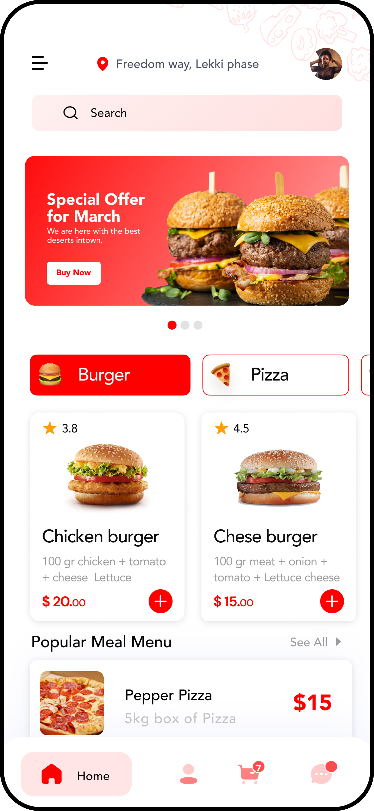
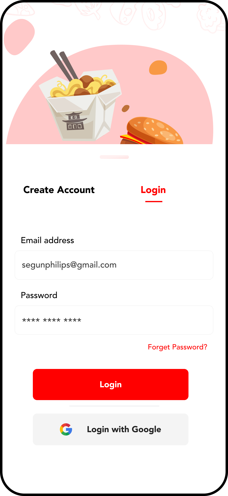
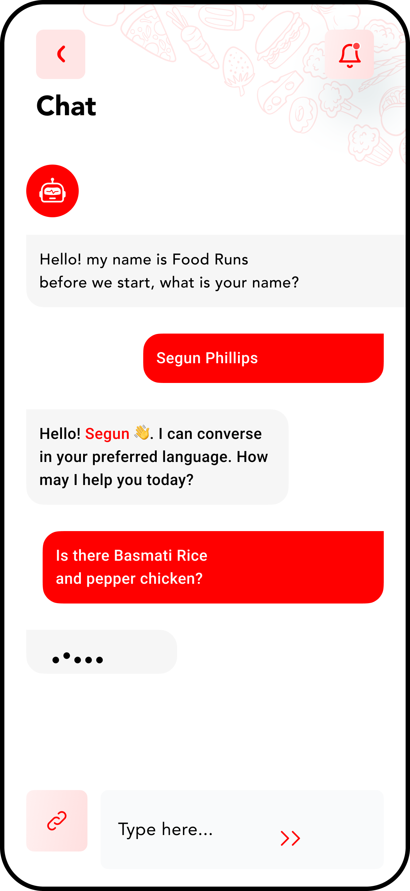
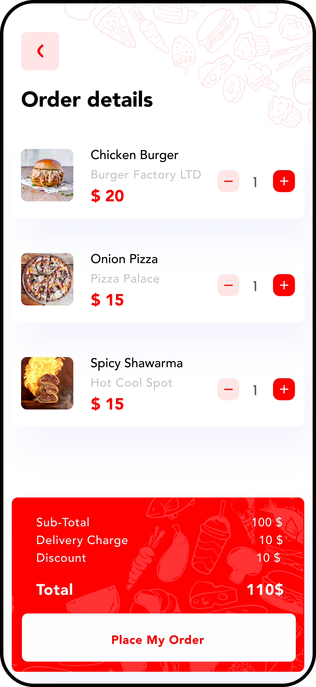

# 🍔 Food Runs - Flutter UI

Modern Food Delivery Mobile UI built with Flutter.  
Designed with clean architecture, smooth navigation flow, and modern mobile UX.

---

## ✨ Features

- 🚀 Onboarding Screens
- 🔐 Login & Authentication Flow
- 📍 Location Setup
- 👤 Profile Screen
- 🏠 Home Menu UI
- 🍕 Product Details
- 🛒 Order System
- 💬 Chat Interface
- ✅ Finish Order Screen

---
## 📱 App Screens

<p align="center">
  
  
  
  
</p>

---

## 🧩 Tech Stack

- Flutter
- Dart
- Material UI
- Clean UI Architecture

---


## 📱 Screenshots

| Home | Product Details | Order |
|------|-----------------|-------|
|  |  |  |

> You can replace these images with real app screenshots.
>
> 📂 Project Structure
> lib/
 ├── screens/
 ├── widgets/
 ├── models/
 └── main.dart


---

## 🚀 Getting Started

```bash
git clone https://github.com/abodjmal2004/food-runs-flutter-ui.git
cd food-runs-flutter-ui
flutter pub get
flutter run
```
---

---

## 👨‍💻 Developer

**Abodjmal** — Flutter UI Developer  

Passionate about building modern mobile UI, clean architecture, and smooth user experiences.

### 🌐 Connect With Me

[](https://t.me/xw_25aa)
[](https://instagram.com/xw_.0)
[](https://github.com/abodjmal2004)


