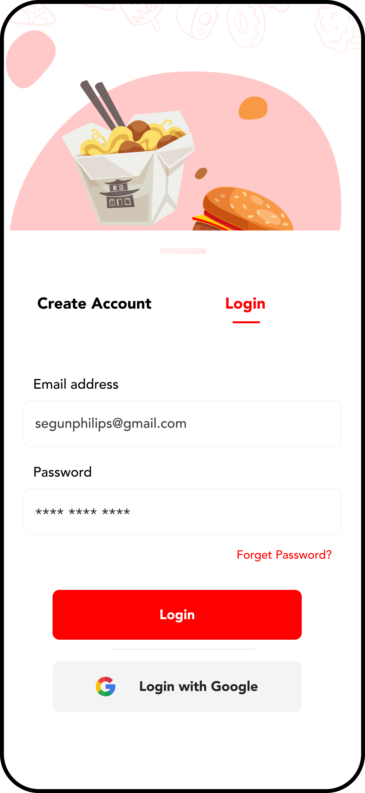
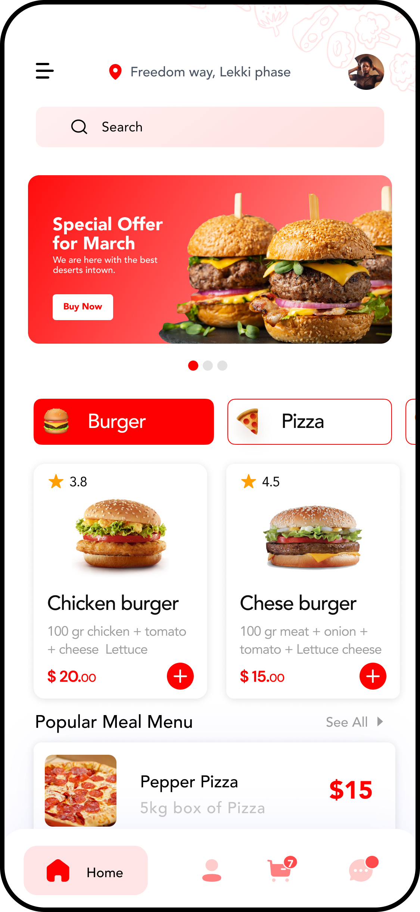
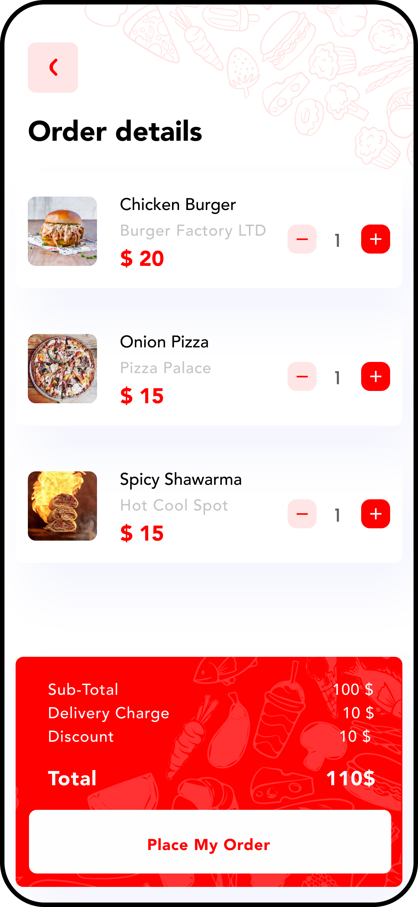
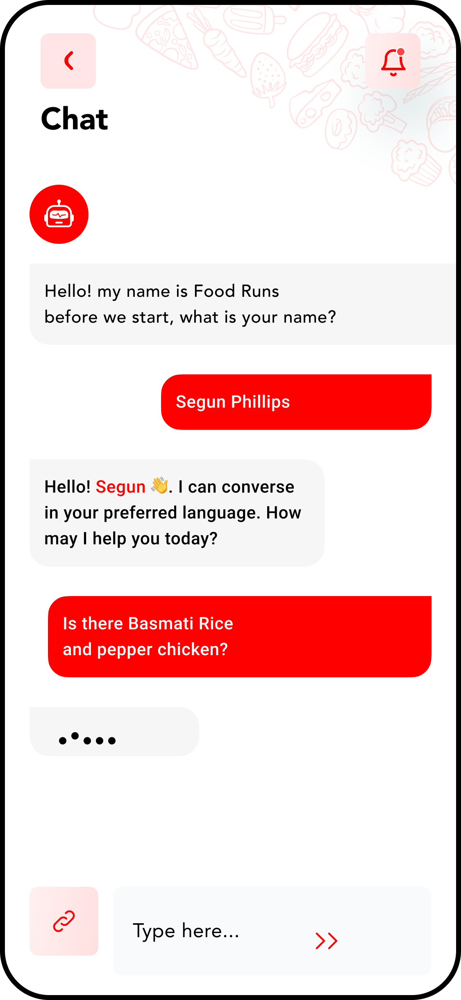

# 🍔 Food Runs - Modern Food Delivery UI

[](https://flutter.dev/)
[](https://dart.dev/)
[](https://flutter.dev/)
[](LICENSE)

A modern, high-fidelity Food Delivery Mobile UI built with **Flutter**. This project showcases a complete user journey from onboarding to checkout, featuring clean architecture, smooth transitions, and a premium mobile UX/UI design.

---

## 📱 App Preview

<p align="center">
  
  
  
  
</p>

---

## 🌟 Key Features

- **🚀 Professional Onboarding:** Engaging flow to welcome users to the app.
- **🔐 Secure Auth UI:** Modern login and registration screens with a focus on usability.
- **📍 Location Intelligence:** Interactive screens for setting up delivery locations.
- **🏠 Dynamic Home UI:** Beautifully crafted menu and category browsing experience.
- **🍕 Product Deep-Dive:** Detailed product screens with customizable options.
- **🛒 Seamless Checkout:** Intuitive order summary and final checkout flow.
- **💬 Real-time Chat UI:** Clean and responsive messaging interface for support or delivery updates.
- **👤 User Profiles:** Personalized profile management screens.

---

## 🛠 Tech Stack & Tools

- **Framework:** [Flutter](https://flutter.dev/) (Cross-platform excellence)
- **Language:** [Dart](https://dart.dev/) (Optimized for UI)
- **Design System:** Material Design 3 (Modern Mobile Standards)
- **Architecture:** Clean UI separation for scalability.
- **Assets:** High-quality custom icons and food illustrations.

---

## 📂 Project Structure

```text
lib/
├── auth_screen.dart           # Authentication Logic & UI
├── home_screen.dart           # Main Marketplace UI
├── product_details_screen.dart # Item Details & Customization
├── chat_screen.dart           # Messaging Interface
├── order_details.dart         # Cart & Order Management
├── onboarding_flow.dart       # User Introduction
└── main_layout.dart           # Core App Navigation
```

---

## 🚀 Getting Started

### Prerequisites
- Flutter SDK installed on your machine.
- An IDE (VS Code or Android Studio).

### Installation
1. **Clone the repository**:
   ```bash
   git clone https://github.com/abodjmal2004/food-runs-flutter-ui.git
   cd food-runs-flutter-ui
   ```
2. **Install dependencies**:
   ```bash
   flutter pub get
   ```
3. **Run the app**:
   ```bash
   flutter run
   ```

---

## 👨‍💻 Developer

**Abod Jamal** — Software Developer & Mobile UI Specialist  
Passionate about building modern mobile applications, clean architecture, and pixel-perfect user experiences. Based in Gaza, Palestine.

### 🌐 Connect With Me
[](https://t.me/xw_25aa)
[](https://instagram.com/xw_.0)
[](https://github.com/abodjmal2004)
[](https://www.linkedin.com/in/abod-jamal-dev/)

---

## 📄 License
This project is licensed under the MIT License - see the [LICENSE](LICENSE) file for details.

---
<p align="center">
  Developed with ❤️ for a better Mobile Experience.
</p>
